# gRPC & Protocol Buffers: The Staff-Level Microservices & Streaming Architecture Masterclass

Welcome to the definitive, production-grade guide to **gRPC** and **Protocol Buffers (proto3)**—the industry-standard, high-performance remote procedure call framework powered by binary serialization, HTTP/2 multiplexing, and bi-directional streaming.

---

## Master Architecture & Curriculum Overview

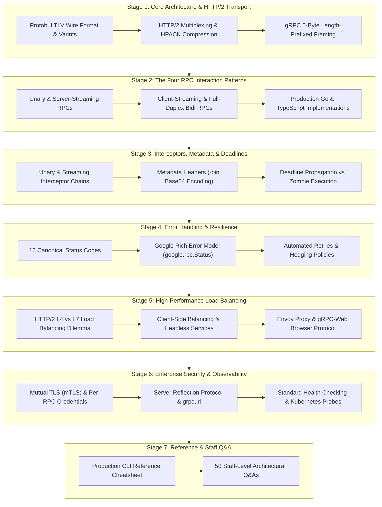

---

## Table of Contents
1. [Stage 1: Core Architecture, Protocol Buffers & HTTP/2 Transport](#stage-1-core-architecture-protocol-buffers--http2-transport)
2. [Stage 2: The Four RPC Communication Patterns & End-to-End Implementation](#stage-2-the-four-rpc-communication-patterns--end-to-end-implementation)
3. [Stage 3: Advanced Interceptors, Metadata, Deadlines & Cancellation](#stage-3-advanced-interceptors-metadata-deadlines--cancellation)
4. [Stage 4: Error Handling & Resilience (Rich Error Model, Retries & Circuit Breakers)](#stage-4-error-handling--resilience-rich-error-model-retries--circuit-breakers)
5. [Stage 5: High-Performance Load Balancing & Name Resolution](#stage-5-high-performance-load-balancing--name-resolution)
6. [Stage 6: Enterprise Security, Reflection, Health Checking & Observability](#stage-6-enterprise-security-reflection-health-checking--observability)
7. [Stage 7: Production API Reference & 50 Staff-Level Interview Questions](#stage-7-production-api-reference--50-staff-level-interview-questions)

---

## Stage 1: Core Architecture, Protocol Buffers & HTTP/2 Transport

### 1.1 The Microservices Communication Dilemma: REST/JSON vs gRPC

In modern distributed microservices architectures, services communicate hundreds of thousands of times per second across internal networks. Relying on traditional **REST over HTTP/1.1 with JSON** introduces severe systemic bottlenecks:

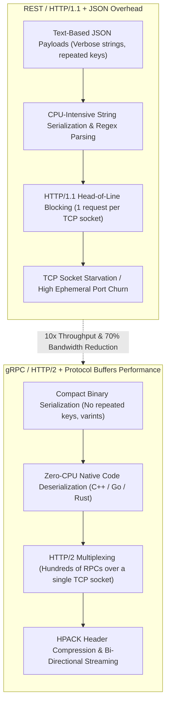

| Communication Dimension | REST over HTTP/1.1 + JSON | gRPC over HTTP/2 + Protocol Buffers |
| :--- | :--- | :--- |
| **Payload Protocol** | Textual JSON (Uncompressed ASCII/UTF-8) | Binary Encoded Protocol Buffers (`.proto`) |
| **Data Contract** | Weak/Implicit (OpenAPI/Swagger docs optional) | **Strict, Compile-Time IDL Contract** (`.proto`) |
| **Underlying Transport** | HTTP/1.1 (or HTTP/2 for browsers) | **HTTP/2 Native** (Binary Framing, Streams, HPACK) |
| **Connection Model** | New TCP connection or pooled keep-alive | **Single Long-Lived Multiplexed TCP Channel** |
| **Streaming Support** | Unidirectional SSE or WebSocket hack | **Native Full-Duplex Bi-Directional Streaming** |
| **Payload Size** | Large ($100\%$ baseline) | Compact ($20\%\text{ to }35\%$ of JSON size) |
| **Serialization Latency**| High (CPU spends cycles parsing strings) | Ultra-Low (Direct bit-shift binary unpacking) |

---

### 1.2 Protocol Buffers (proto3) Internals & Wire Format

Protocol Buffers is Google's language-neutral, platform-neutral, extensible mechanism for serializing structured data. Unlike JSON or XML, Protocol Buffers discards field names completely during transmission.

#### Anatomy of a `.proto` Definition:
```protobuf
syntax = "proto3";

package enterprise.billing.v1;

option go_package = "github.com/enterprise/billing/v1;billingv1";

message PaymentTransaction {
  string transaction_id = 1;  // Field tag 1
  double amount_usd     = 2;  // Field tag 2
  string currency       = 3;  // Field tag 3
  bool is_settled       = 4;  // Field tag 4
  int64 created_at_ms   = 5;  // Field tag 5
}
```

#### How the Binary Wire Format Operates:
Instead of transmitting the string `"transaction_id"`, Protobuf transmits a **Tag-Length-Value (TLV)** binary record:

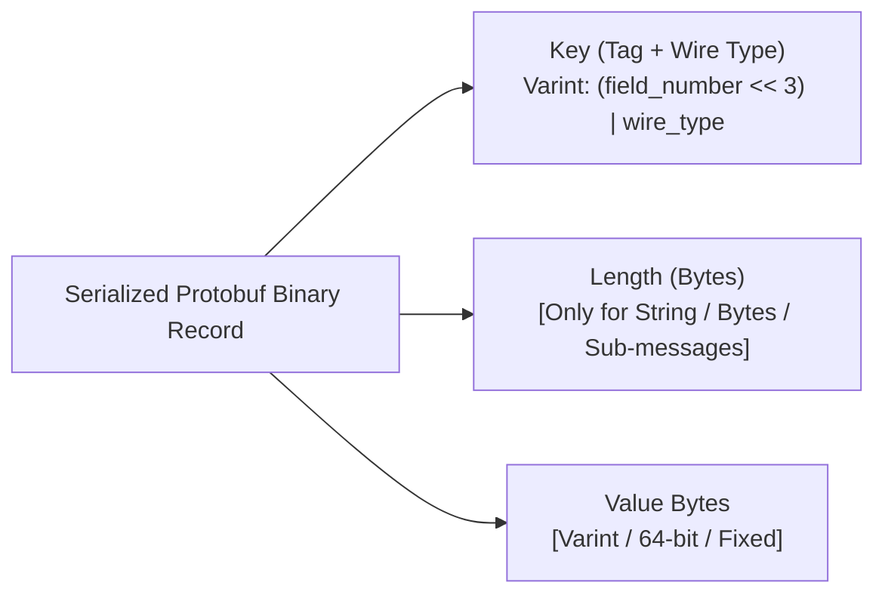

| Wire Type | Name | Typical Data Types | Description |
| :--- | :--- | :--- | :--- |
| **`0`** | **Varint** | `int32`, `int64`, `uint32`, `bool`, `enum` | Variable-length zigzag integer (1 to 10 bytes). |
| **`1`** | **64-bit** | `fixed64`, `double` | Exactly 8 bytes in little-endian order. |
| **`2`** | **Length-Delimited** | `string`, `bytes`, embedded messages, packed repeated | Followed by a varint length, then raw payload bytes. |
| **`5`** | **32-bit** | `fixed32`, `float` | Exactly 4 bytes in little-endian order. |

#### Varint & ZigZag Encoding Mechanics:
- **Varints**: Standard 32-bit integers consume 4 bytes even for small numbers like `1`. In Protobuf, integers use variable-length encoding: each byte uses 7 bits for data and 1 bit (MSB, Most Significant Bit) as a continuation flag. The number `1` is serialized into **a single byte** (`0x01`).
- **ZigZag Encoding (`sint32`, `sint64`)**: Standard varints encode negative numbers (e.g. `-1`) using sign extension into 10 bytes. ZigZag maps signed integers to unsigned integers:
  $$\text{ZigZag}(n) = (n \ll 1) \oplus (n \gg 31)$$
  Small negative numbers (e.g. `-1`, `-2`) map to small positive values (`1`, `3`), encoding in 1 or 2 bytes.

---

### 1.3 Backward & Forward Compatibility Rules in Protobuf

Protobuf provides enterprise-grade schema evolution without breaking existing clients:

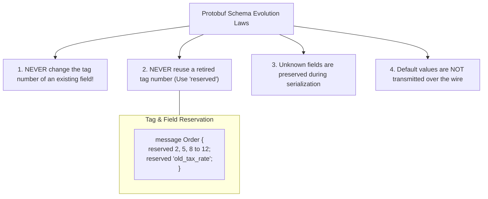

1. **Adding Fields**: You can add new fields with new tag numbers. Old clients reading new messages ignore unrecognized tags. New clients reading old messages populate default values (empty string, 0, false).
2. **Deleting Fields**: Never delete a field tag without marking it `reserved`. If a developer assigns a recycled tag in the future, old messages will decode into the wrong data types, corrupting business logic.
3. **Wire Compatibility**: You can change an `int32` to an `int64` because both use wire type 0 (varint). However, changing `string` (wire type 2) to `int32` breaks binary decoding.

---

### 1.4 HTTP/2 Transport: Multiplexing, Framing & Streams

gRPC uses **HTTP/2** as its underlying transport protocol. HTTP/2 eliminates the Head-of-Line (HoL) blocking of HTTP/1.1 by decomposing communication into independent, interleaved **Binary Frames**:

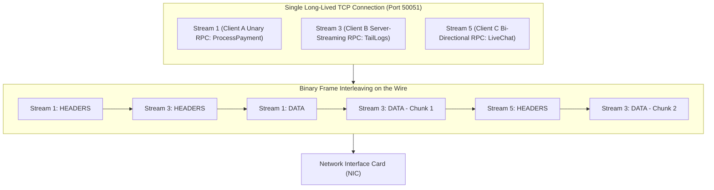

#### Key Technical Primitives of HTTP/2 in gRPC:
1. **Binary Framing Layer**: Replaces ASCII text with small, typed binary frames (`HEADERS`, `DATA`, `SETTINGS`, `RST_STREAM`, `PING`).
2. **Streams & Stream IDs**: A logical bidirectional channel within a TCP connection. Client-initiated streams have odd IDs ($1, 3, 5 \dots$); server-initiated streams have even IDs.
3. **HPACK Header Compression**: Maintains a shared sliding-window compression table between client and server. Repeated HTTP headers (e.g. `authorization`, `user-agent`, `content-type: application/grpc`) are transmitted as a single 1-byte index, reducing header overhead from kilobytes down to bytes.
4. **Flow Control (WINDOW_UPDATE)**: Stream-level and connection-level flow control prevents a fast producer from overwhelming a slow consumer's memory buffer.

---

### 1.5 gRPC Framing: Length-Prefixed Message Envelope

A gRPC payload transmitted over an HTTP/2 `DATA` frame is wrapped in a **5-byte length-prefixed header**:

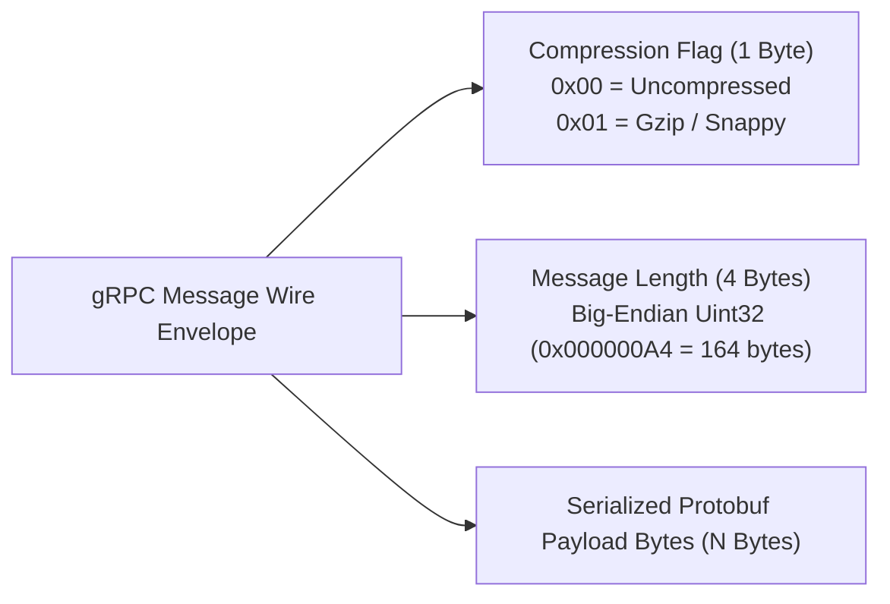

1. **Byte 0 (Compression Flag)**: 1 byte. Indicates whether the Protobuf payload is compressed (using gzip, snappy, or zstd).
2. **Bytes 1–4 (Message Length)**: 4-byte unsigned big-endian integer. Specifies the exact length of the serialized Protobuf payload in bytes.
3. **Bytes 5..$N$ (Protobuf Payload)**: The actual binary Protocol Buffer bytes.

Because HTTP/2 frames can be fragmented across TCP packets, this 5-byte header allows the gRPC framing parser to know precisely when a message begins and ends without reading delimiters.


---

## Stage 2: The Four RPC Communication Patterns & End-to-End Implementation

### 2.1 The Four RPC Interaction Models

Unlike REST APIs which are strictly bound to request-response cycles, gRPC natively supports four distinct communication paradigms over HTTP/2 streams:

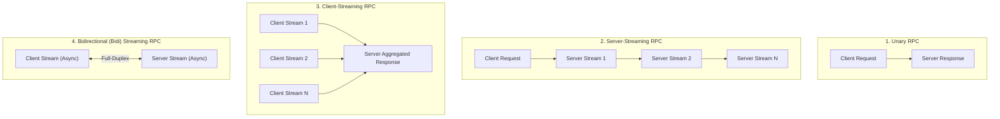

| RPC Pattern | IDL Method Signature | Client Action | Server Action | Primary Production Use Cases |
| :--- | :--- | :--- | :--- | :--- |
| **Unary** | `rpc GetOrder(OrderRequest) returns (OrderResponse);` | Sends 1 request | Returns 1 response | Standard CRUD, payment processing, user authentication. |
| **Server Streaming** | `rpc StreamLogs(LogRequest) returns (stream LogMessage);` | Sends 1 request | Returns stream of messages | Real-time dashboards, log tailing, live financial market ticker feeds. |
| **Client Streaming** | `rpc UploadTelemetry(stream Metric) returns (UploadSummary);` | Sends stream of messages | Returns 1 response upon completion | Large file chunks upload, IoT sensor batch ingestion, audit trails. |
| **Bidirectional** | `rpc ChatSession(stream ChatMessage) returns (stream ChatMessage);` | Sends stream of messages | Sends stream of messages | Live collaborative editing, gaming multiplayer state sync, live bidding. |

---

### 2.2 The Protobuf Service Definition (`orders.proto`)

```protobuf
syntax = "proto3";

package enterprise.orders.v1;

option go_package = "github.com/enterprise/orders/v1;ordersv1";

service OrderService {
  // 1. Unary RPC
  rpc CreateOrder (CreateOrderRequest) returns (OrderResponse);

  // 2. Server-Streaming RPC
  rpc StreamOrderUpdates (OrderSubscription) returns (stream OrderStatusUpdate);

  // 3. Client-Streaming RPC
  rpc BulkUploadOrders (stream CreateOrderRequest) returns (BulkUploadSummary);

  // 4. Bidirectional Streaming RPC
  rpc OrderNegotiation (stream NegotiationOffer) returns (stream NegotiationCounter);
}

message CreateOrderRequest {
  string customer_id  = 1;
  string sku          = 2;
  int32 quantity      = 3;
  double price_usd    = 4;
}

message OrderResponse {
  string order_id     = 1;
  string status       = 2;
  int64 timestamp_ms  = 3;
}

message OrderSubscription {
  string customer_id  = 1;
}

message OrderStatusUpdate {
  string order_id     = 1;
  string status       = 2;
  string details      = 3;
}

message BulkUploadSummary {
  int32 total_received = 1;
  int32 total_accepted = 2;
  double total_volume  = 3;
}

message NegotiationOffer {
  string order_id     = 1;
  double offered_price = 2;
}

message NegotiationCounter {
  string order_id     = 1;
  double counter_price = 2;
  bool is_accepted    = 3;
}
```

---

### 2.3 Production Go Implementation: High-Throughput Server

Here is a complete, production-grade Go implementation of the `OrderService` implementing all four RPC methods with context-awareness, goroutine synchronization, and error handling:

```go
package main

import (
	"context"
	"fmt"
	"io"
	"log"
	"net"
	"time"

	"google.golang.org/grpc"
	"google.golang.org/grpc/codes"
	"google.golang.org/grpc/status"

	pb "github.com/enterprise/orders/v1"
)

type server struct {
	pb.UnimplementedOrderServiceServer
}

// 1. Unary RPC Implementation
func (s *server) CreateOrder(ctx context.Context, req *pb.CreateOrderRequest) (*pb.OrderResponse, error) {
	if req.CustomerId == "" || req.Quantity <= 0 {
		return nil, status.Errorf(codes.InvalidArgument, "invalid customer_id or quantity")
	}

	orderID := fmt.Sprintf("ORD-%d", time.Now().UnixNano())
	log.Printf("[Unary] Created order %s for customer %s", orderID, req.CustomerId)

	return &pb.OrderResponse{
		OrderId:     orderID,
		Status:      "CREATED",
		TimestampMs: time.Now().UnixMilli(),
	}, nil
}

// 2. Server-Streaming RPC Implementation
func (s *server) StreamOrderUpdates(req *pb.OrderSubscription, stream pb.OrderService_StreamOrderUpdatesServer) error {
	log.Printf("[Server-Stream] Client subscribed to updates for customer: %s", req.CustomerId)
	statuses := []string{"PROCESSING", "INVENTORY_RESERVED", "PACKAGED", "DISPATCHED"}

	for _, st := range statuses {
		select {
		case <-stream.Context().Done():
			log.Println("[-] Client disconnected or cancelled stream")
			return stream.Context().Err()
		case <-time.After(500 * time.Millisecond):
			update := &pb.OrderStatusUpdate{
				OrderId: "ORD-99124",
				Status:  st,
				Details: fmt.Sprintf("Transitioned to %s", st),
			}
			if err := stream.Send(update); err != nil {
				return status.Errorf(codes.Internal, "failed to stream update: %v", err)
			}
		}
	}
	return nil
}

// 3. Client-Streaming RPC Implementation
func (s *server) BulkUploadOrders(stream pb.OrderService_BulkUploadOrdersServer) error {
	var totalReceived, totalAccepted int32
	var totalVolume float64

	for {
		req, err := stream.Recv()
		if err == io.EOF {
			// Client finished streaming; return single summary
			return stream.SendAndClose(&pb.BulkUploadSummary{
				TotalReceived: totalReceived,
				TotalAccepted: totalAccepted,
				TotalVolume:  totalVolume,
			})
		}
		if err != nil {
			return status.Errorf(codes.Internal, "stream read error: %v", err)
		}

		totalReceived++
		if req.Quantity > 0 && req.PriceUsd > 0 {
			totalAccepted++
			totalVolume += float64(req.Quantity) * req.PriceUsd
		}
	}
}

// 4. Bidirectional Streaming RPC Implementation
func (s *server) OrderNegotiation(stream pb.OrderService_OrderNegotiationServer) error {
	for {
		offer, err := stream.Recv()
		if err == io.EOF {
			return nil
		}
		if err != nil {
			return err
		}

		// Price negotiation algorithm
		counter := offer.OfferedPrice * 1.05
		accepted := offer.OfferedPrice >= 100.0

		resp := &pb.NegotiationCounter{
			OrderId:      offer.OrderId,
			CounterPrice: counter,
			IsAccepted:   accepted,
		}

		if err := stream.Send(resp); err != nil {
			return err
		}
	}
}

func main() {
	lis, err := net.Listen("tcp", ":50051")
	if err != nil {
		log.Fatalf("failed to listen: %v", err)
	}

	grpcServer := grpc.NewServer()
	pb.RegisterOrderServiceServer(grpcServer, &server{})

	log.Println("[+] gRPC OrderService running on :50051")
	if err := grpcServer.Serve(lis); err != nil {
		log.Fatalf("failed to serve: %v", err)
	}
}
```

---

### 2.4 Production Go Client Implementation

```go
package main

import (
	"context"
	"io"
	"log"
	"time"

	"google.golang.org/grpc"
	"google.golang.org/grpc/credentials/insecure"

	pb "github.com/enterprise/orders/v1"
)

func main() {
	// Establish long-lived HTTP/2 multiplexed channel
	conn, err := grpc.NewClient("localhost:50051", grpc.WithTransportCredentials(insecure.NewCredentials()))
	if err != nil {
		log.Fatalf("failed to connect: %v", err)
	}
	defer conn.Close()

	client := pb.NewOrderServiceClient(conn)
	ctx, cancel := context.WithTimeout(context.Background(), 5*time.Second)
	defer cancel()

	// 1. Execute Unary RPC
	res, err := client.CreateOrder(ctx, &pb.CreateOrderRequest{
		CustomerId: "CUST-8812",
		Sku:        "SERVER-RACK-X",
		Quantity:   2,
		PriceUsd:   1299.99,
	})
	if err != nil {
		log.Fatalf("Unary CreateOrder failed: %v", err)
	}
	log.Printf("[+] Order Created: ID=%s Status=%s", res.OrderId, res.Status)

	// 2. Execute Server-Streaming RPC
	stream, err := client.StreamOrderUpdates(ctx, &pb.OrderSubscription{CustomerId: "CUST-8812"})
	if err != nil {
		log.Fatalf("ServerStream failed: %v", err)
	}
	for {
		update, err := stream.Recv()
		if err == io.EOF {
			break
		}
		if err != nil {
			log.Fatalf("Error reading stream: %v", err)
		}
		log.Printf("[Stream Update] Order=%s Status=%s Details=%s", update.OrderId, update.Status, update.Details)
	}
}
```

---

### 2.5 TypeScript / Node.js Client Implementation

```typescript
import * as grpc from '@grpc/grpc-js';
import * as protoLoader from '@grpc/proto-loader';
import path from 'path';

const PROTO_PATH = path.resolve(__dirname, './orders.proto');
const packageDef = protoLoader.loadSync(PROTO_PATH, {
  keepCase: true,
  longs: String,
  enums: String,
  defaults: true,
  oneofs: true,
});

const protoDescriptor = grpc.loadPackageDefinition(packageDef) as any;
const orderService = protoDescriptor.enterprise.orders.v1.OrderService;

const client = new orderService('localhost:50051', grpc.credentials.createInsecure());

// Call Unary RPC
client.CreateOrder(
  { customer_id: 'CUST-NODE-1', sku: 'NVME-4TB', quantity: 4, price_usd: 249.5 },
  (err: grpc.ServiceError | null, response: any) => {
    if (err) {
      console.error('[-] gRPC Error:', err.message);
      return;
    }
    console.log('[+] Order Created via Node.js:', response.order_id);
  }
);
```


---

## Stage 3: Advanced Interceptors, Metadata, Deadlines & Cancellation

### 3.1 gRPC Interceptors: The Production Middleware Pipeline

In enterprise microservices, cross-cutting concerns (authentication, request logging, distributed tracing, panic recovery, and rate limiting) must never pollute core business domain logic.

gRPC implements the **Interceptor Pattern** (analogous to HTTP middleware). Interceptors wrap RPC invocations on both the client and server sides:

```mermaid
flowchart LR
    subgraph ClientPipeline["Client Execution Pipeline"]
        CApp["Client Code"] --> CInt1["Logging Interceptor"]
        CInt1 --> CInt2["Auth Header Injector"]
        CInt2 --> CInt3["Tracing Span Injector"]
        CInt3 --> Transport["HTTP/2 Client Transport"]
    end

    Transport -->|"Wire Transfer"| STransport["HTTP/2 Server Transport"]

    subgraph ServerPipeline["Server Execution Pipeline"]
        STransport --> SInt1["Panic Recovery Interceptor"]
        SInt1 --> SInt2["Auth & RBAC Validator"]
        SInt2 --> SInt3["Prometheus Metrics Interceptor"]
        SInt3 --> SHandler["OrderService Handler"]
    end
```

#### The Four Interceptor Interfaces:
1. **Unary Client Interceptor**: Intercepts single request-response invocations before leaving the client.
2. **Unary Server Interceptor**: Intercepts incoming unary RPCs before reaching the service handler.
3. **Stream Client Interceptor**: Wraps the `ClientStream` object to inspect streamed messages.
4. **Stream Server Interceptor**: Wraps the `ServerStream` object to monitor inbound and outbound stream frames.

---

### 3.2 Production Server Interceptor Implementation (Go)

Here is a chainable Go unary interceptor pipeline providing JWT authentication validation and execution latency logging:

```go
package main

import (
	"context"
	"log"
	"strings"
	"time"

	"google.golang.org/grpc"
	"google.golang.org/grpc/codes"
	"google.golang.org/grpc/metadata"
	"google.golang.org/grpc/status"
)

// 1. Authentication Interceptor
func AuthUnaryServerInterceptor(ctx context.Context, req interface{}, info *grpc.UnaryServerInfo, handler grpc.UnaryHandler) (interface{}, error) {
	// Skip authentication on public health checks
	if strings.HasPrefix(info.FullMethod, "/grpc.health.v1.Health/") {
		return handler(ctx, req)
	}

	md, ok := metadata.FromIncomingContext(ctx)
	if !ok {
		return nil, status.Errorf(codes.Unauthenticated, "missing metadata headers")
	}

	authHeaders := md.Get("authorization")
	if len(authHeaders) == 0 || !strings.HasPrefix(authHeaders[0], "Bearer ") {
		return nil, status.Errorf(codes.Unauthenticated, "missing or malformed Bearer token")
	}

	token := strings.TrimPrefix(authHeaders[0], "Bearer ")
	if token != "secret-enterprise-token-9941" {
		return nil, status.Errorf(codes.PermissionDenied, "invalid token credentials")
	}

	// Token valid; proceed down the middleware pipeline
	return handler(ctx, req)
}

// 2. Metrics & Telemetry Logging Interceptor
func TelemetryUnaryServerInterceptor(ctx context.Context, req interface{}, info *grpc.UnaryServerInfo, handler grpc.UnaryHandler) (interface{}, error) {
	start := time.Now()
	resp, err := handler(ctx, req)
	duration := time.Since(start)

	statusCode := status.Code(err)
	log.Printf("[gRPC SRE] method=%s duration=%s status=%s error=%v",
		info.FullMethod, duration, statusCode.String(), err)

	return resp, err
}

// 3. Register Interceptors Chained into gRPC Server
func NewEnterpriseServer() *grpc.Server {
	return grpc.NewServer(
		grpc.ChainUnaryInterceptor(
			TelemetryUnaryServerInterceptor,
			AuthUnaryServerInterceptor,
		),
	)
}
```

---

### 3.3 Metadata & Context Propagation

In HTTP/1.1, auxiliary context is passed via HTTP request headers. In gRPC, this information is termed **Metadata** (`metadata.MD`), which serializes directly into HTTP/2 `HEADERS` frames as a map of strings to arrays of strings (`map[string][]string`):

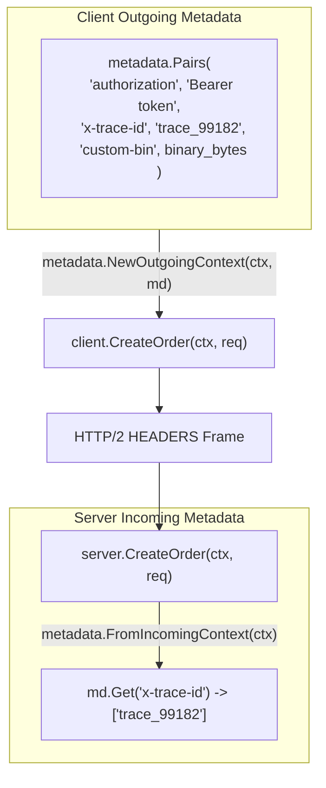

#### Binary Metadata Keys (`-bin` Suffix):
Standard HTTP/2 header values must be ASCII strings. If you need to transmit raw binary data (e.g. encrypted session tokens or binary tracing context), gRPC mandates that the metadata key **must end with the `-bin` suffix** (e.g. `trace-context-bin`). 
When a key ends in `-bin`, the gRPC runtime **automatically Base64-encodes** the binary bytes before transmission over the wire, and Base64-decodes them transparently upon receipt.

---

### 3.4 Deadlines vs Timeouts & Distributed Propagation

A common failure mode in microservice architectures is **zombie execution**: Service A calls Service B, which calls Service C, which calls a slow database. If Service A gives up after 2 seconds, Service B and Service C continue wasting CPU, memory, and database connection pools processing a request whose caller has already disconnected.

gRPC solves this through **Deadlines**:

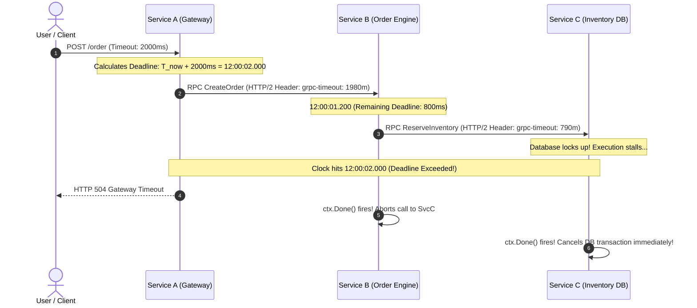

#### Why Deadlines are Architecturally Superior to Timeouts:
- A **Timeout** is relative ("wait 5 seconds"). If passed downstream, every service adds its own 5 seconds, resulting in unbounded cascading delays ($5\text{s} + 5\text{s} + 5\text{s} = 15\text{s}$).
- A **Deadline** is an **absolute point in time** ("this entire transaction must terminate by 14:02:15.500 UTC"). As the call traverses through 10 downstream microservices, the remaining time decreases monotonically across every hop.
- The gRPC client library automatically calculates remaining time and sends it in the `grpc-timeout` HTTP/2 header. Downstream services wrap their local context with this deadline.

#### Context Deadline Implementation:
```go
// Client: Set absolute 3-second deadline
ctx, cancel := context.WithTimeout(context.Background(), 3*time.Second)
defer cancel()

resp, err := client.CreateOrder(ctx, req)
if err != nil {
    st, ok := status.FromError(err)
    if ok && st.Code() == codes.DeadlineExceeded {
        log.Println("[-] Request aborted: Deadline exceeded before completion.")
    }
}
```

---

### 3.5 Client Cancellation & Graceful Teardown

When an end-user navigates away from a web page or closes a mobile application, the client should cancel active streaming RPCs immediately:

```go
ctx, cancel := context.WithCancel(context.Background())

go func() {
    // Simulate user pressing 'Cancel' button after 1 second
    time.Sleep(1 * time.Second)
    log.Println("[!] User cancelled streaming request")
    cancel()
}()

stream, err := client.StreamOrderUpdates(ctx, &pb.OrderSubscription{CustomerId: "CUST-1"})
// The server detects stream.Context().Done() and terminates immediately
```
When `cancel()` is invoked:
1. The client transport emits an HTTP/2 **`RST_STREAM`** frame with code `CANCEL` (`0x08`) over the wire.
2. The server's `ctx.Done()` channel unblocks immediately.
3. The server goroutine aborts database queries, frees memory buffers, and exits cleanly without leaking resources.


---

## Stage 4: Error Handling & Resilience (Rich Error Model, Retries & Circuit Breakers)

### 4.1 Canonical gRPC Status Codes

Unlike HTTP/1.1 REST which relies on hundreds of disparate HTTP status codes ($200, 201, 400, 401, 403, 404, 429, 500, 502, 503 \dots$), gRPC defines **16 Canonical Status Codes** in the `google.rpc.Code` specification:

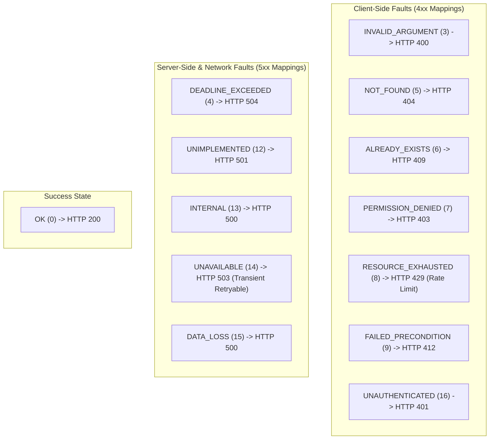

| Code | Value | Meaning & Production Usage Guidance |
| :--- | :--- | :--- |
| **`OK`** | `0` | Successful execution. |
| **`CANCELLED`** | `1` | Operation cancelled by client (typically via context cancellation). |
| **`UNKNOWN`** | `2` | Unhandled runtime exception or non-gRPC error returned by third-party library. |
| **`INVALID_ARGUMENT`** | `3` | Client passed invalid argument (e.g. malformed email or negative quantity). |
| **`DEADLINE_EXCEEDED`** | `4` | Operation expired before completing. Always safe to log as client/system timeout. |
| **`NOT_FOUND`** | `5` | Requested entity (e.g. user ID or order ID) does not exist in datastore. |
| **`ALREADY_EXISTS`** | `6` | Attempted to create an entity that already exists (e.g. duplicate primary key). |
| **`PERMISSION_DENIED`**| `7` | Caller authenticated, but lacks RBAC permissions to execute action. |
| **`RESOURCE_EXHAUSTED`**| `8` | Client exceeded rate limit quota or disk/memory is exhausted. |
| **`FAILED_PRECONDITION`**| `9` | System not in state required for execution (e.g. account suspended). |
| **`ABORTED`** | `10` | Concurrency conflict (e.g. read-modify-write transaction abort). |
| **`UNAVAILABLE`** | `14` | Service temporarily down, restarting, or network partition. **Safe to retry!** |
| **`UNAUTHENTICATED`** | `16` | Missing, expired, or invalid authentication credentials. |

---

### 4.2 The Google Rich Error Model (`google.rpc.Status`)

A simple string error message (`"Payment failed"`) is insufficient for modern microservices: clients need structured error details, field-level validation errors, and localized error strings.

gRPC solves this with the **Rich Error Model** (`google.rpc.Status`), which serializes structured Protobuf messages into the HTTP/2 `grpc-status-details-bin` trailer header:

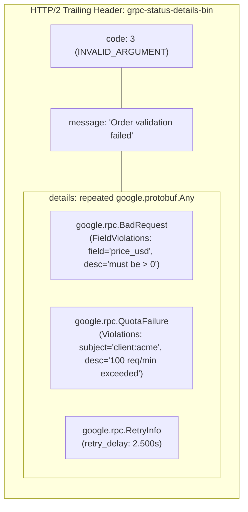

#### Complete Implementation: Emitting and Parsing Rich Errors (Go)

```go
package main

import (
	"context"
	"log"

	"google.golang.org/genproto/googleapis/rpc/errdetails"
	"google.golang.org/grpc/codes"
	"google.golang.org/grpc/status"
	"google.golang.org/protobuf/types/known/durationpb"
	"time"

	pb "github.com/enterprise/orders/v1"
)

// Server: Emitting Rich Error Details
func (s *server) CreateOrderWithRichError(ctx context.Context, req *pb.CreateOrderRequest) (*pb.OrderResponse, error) {
	if req.PriceUsd <= 0 {
		// 1. Create base status
		st := status.New(codes.InvalidArgument, "Validation failed on incoming order")

		// 2. Attach BadRequest field violations
		badReqDetail := &errdetails.BadRequest{
			FieldViolations: []*errdetails.BadRequest_FieldViolation{
				{
					Field:       "price_usd",
					Description: "Unit price must be strictly positive",
				},
			},
		}

		// 3. Attach RetryInfo
		retryDetail := &errdetails.RetryInfo{
			RetryDelay: durationpb.New(2 * time.Second),
		}

		// 4. Attach details to status object
		stWithDetails, err := st.WithDetails(badReqDetail, retryDetail)
		if err != nil {
			return nil, st.Err()
		}

		// Returns error packed into 'grpc-status-details-bin' trailer
		return nil, stWithDetails.Err()
	}

	return &pb.OrderResponse{OrderId: "ORD-1"}, nil
}

// Client: Extracting Rich Error Details
func handleClientError(err error) {
	st := status.Convert(err)
	log.Printf("[-] RPC Failed: code=%s message=%s", st.Code(), st.Message())

	// Inspect strongly-typed error detail messages
	for _, detail := range st.Details() {
		switch t := detail.(type) {
		case *errdetails.BadRequest:
			for _, violation := range t.GetFieldViolations() {
				log.Printf("  [Field Error] %s: %s", violation.GetField(), violation.GetDescription())
			}
		case *errdetails.RetryInfo:
			log.Printf("  [Retry Guidance] Client should back off for %v", t.GetRetryDelay().AsDuration())
		}
	}
}
```

---

### 4.3 Automated Retries via gRPC Service Config

Rather than forcing application developers to write manual `for`-loops with `time.Sleep` around every RPC, gRPC supports **declarative retry policies** defined via JSON **Service Config**:

```json
{
  "methodConfig": [
    {
      "name": [
        { "service": "enterprise.orders.v1.OrderService", "method": "GetOrder" }
      ],
      "retryPolicy": {
        "maxAttempts": 4,
        "initialBackoff": "0.1s",
        "maxBackoff": "1.0s",
        "backoffMultiplier": 2.0,
        "retryableStatusCodes": [
          "UNAVAILABLE",
          "RESOURCE_EXHAUSTED"
        ]
      }
    }
  ]
}
```

#### How Automated Backoff Operates:
1. Attempt 1 fails with `UNAVAILABLE`.
2. Delay = $\text{initialBackoff} \times (\text{backoffMultiplier})^0 = 0.1\text{s} \pm \text{random jitter}$.
3. Attempt 2 fails with `UNAVAILABLE`.
4. Delay = $0.1 \times 2^1 = 0.2\text{s} \pm \text{jitter}$.
5. Attempt 3 fails with `UNAVAILABLE`.
6. Delay = $\min(0.1 \times 2^2, \text{maxBackoff}) = 0.4\text{s}$.
7. Attempt 4 succeeds or fails permanently.

> [!WARNING]
> **Idempotency Rule for Retries**: Retries MUST ONLY be enabled on **idempotent methods** (e.g. `GetOrder`, `ListOrders`, or methods using an idempotency key). Retrying non-idempotent methods (e.g. `ChargeCreditCard`) on network timeouts causes duplicate financial charges!

---

### 4.4 Hedging Policies for Tail Latency Elimination

In large clusters, P99 tail latency is often caused by a single slow broker or degraded container (CPU throttling, garbage collection pause). **Hedging** eliminates tail latency by issuing duplicate requests in parallel:

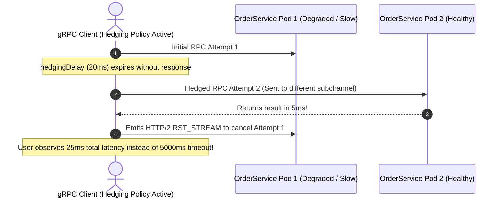

#### Hedging Policy Configuration in Service Config:
```json
{
  "hedgingPolicy": {
    "maxAttempts": 3,
    "hedgingDelay": "0.02s",
    "nonFatalStatusCodes": ["UNAVAILABLE", "INTERNAL"]
  }
}
```
If Attempt 1 does not respond within `hedgingDelay` (20ms), the client dispatches Attempt 2 to another replica. The client accepts the first response that succeeds and immediately cancels all other in-flight attempts.


---

## Stage 5: High-Performance Load Balancing & Name Resolution

### 5.1 The HTTP/2 L4 vs L7 Load Balancing Dilemma

A common failure mode when migrating from REST to gRPC in Kubernetes is discovering that **all traffic routes to a single pod**, leaving other replicas completely idle.

This occurs because of the fundamental difference between **Layer 4 (L4)** and **Layer 7 (L7)** load balancing:

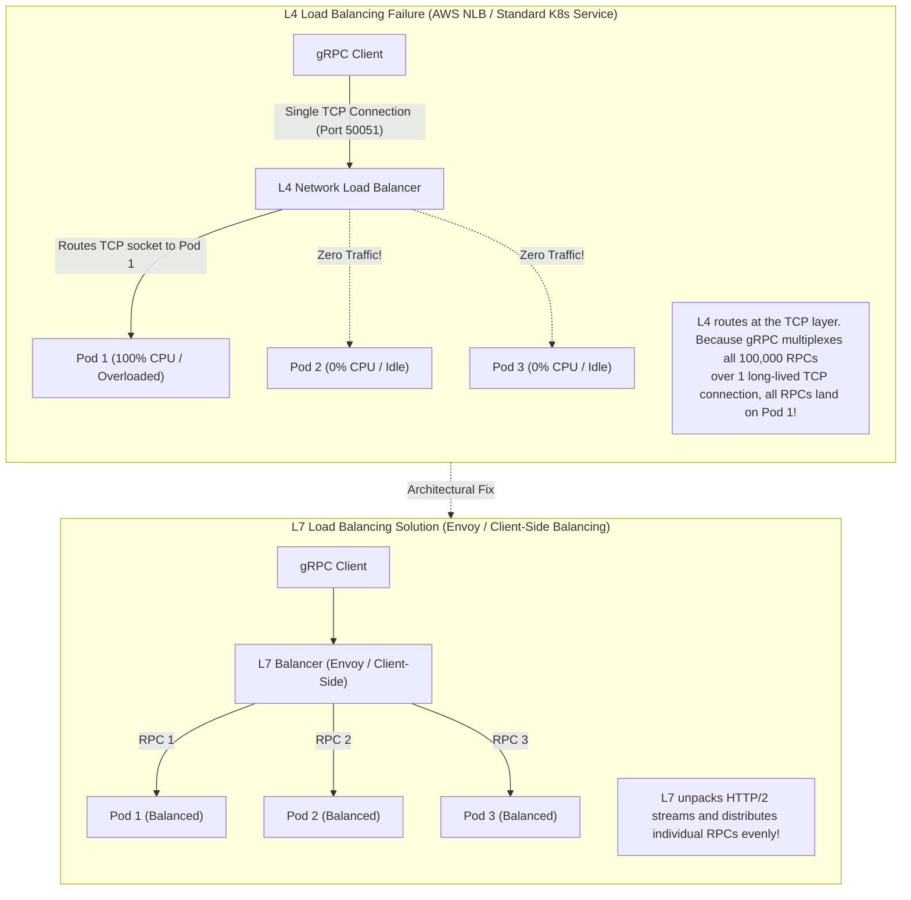

---

### 5.2 Architectural Options for gRPC Load Balancing

To distribute individual RPCs across a pool of backend pods, you have three architectural patterns:

| Architecture Pattern | How It Works | Latency Impact | Operational Complexity | Best Production Fit |
| :--- | :--- | :--- | :--- | :--- |
| **Client-Side Balancing** | Client queries DNS/K8s Headless Service, opens TCP subchannels to *every* pod, and round-robins RPCs locally. | **Zero Added Latency** (Direct pod-to-pod) | Moderate (Logic embedded in application binary) | High-performance internal Go/Java/Rust microservices. |
| **Proxy-Based (L7 Proxy)** | Client connects to Envoy / NGINX. The proxy unpacks HTTP/2 streams and load balances to backends. | Slight ($0.5–1.5\text{ms}$ hop delay) | Low (Centralized routing, TLS termination) | Ingress traffic, public gateways, polyglot environments. |
| **Lookaside (xDS Service Mesh)** | Client speaks to control plane (Istio/Consul) via xDS protocol to get dynamic routing rules. | **Zero Added Latency** | High (Requires service mesh control plane) | Large enterprise Kubernetes clusters ($>100$ services). |

---

### 5.3 Implementing Client-Side Load Balancing with Kubernetes Headless Services

In Kubernetes, standard `ClusterIP` services assign a virtual IP that executes L4 IPTables routing. To enable **Client-Side Load Balancing**, create a **Headless Service** (`clusterIP: None`):

```yaml
apiVersion: v1
kind: Service
metadata:
  name: order-service-headless
  namespace: microservices
spec:
  clusterIP: None # Headless service returns all pod IPs via DNS A records
  selector:
    app: order-service
  ports:
  - port: 50051
    targetPort: 50051
    name: grpc
```

#### Go Client Configuration for Round-Robin Subchannels:
Configure the client with the `dns:///` resolver scheme and set the load balancing policy to `round_robin`:

```go
package main

import (
	"log"

	"google.golang.org/grpc"
	"google.golang.org/grpc/credentials/insecure"
)

func main() {
	// 1. Target URI using dns:/// scheme pointing to K8s headless service
	serviceURI := "dns:///order-service-headless.microservices.svc.cluster.local:50051"

	// 2. Configure Round-Robin Load Balancing Policy via Service Config
	roundRobinConfig := `{"loadBalancingConfig": [{"round_robin": {}}]}`

	conn, err := grpc.NewClient(
		serviceURI,
		grpc.WithTransportCredentials(insecure.NewCredentials()),
		grpc.WithDefaultServiceConfig(roundRobinConfig),
	)
	if err != nil {
		log.Fatalf("failed to dial: %v", err)
	}
	defer conn.Close()

	// The client opens TCP subchannels to ALL pod IPs resolved by DNS
	// and automatically round-robins individual RPCs across all replicas!
}
```

---

### 5.4 The gRPC-Web Protocol: Bridging Browsers to gRPC

Standard web browsers (Chrome, Firefox, Safari) cannot communicate directly with native gRPC servers:
1. **No Low-Level HTTP/2 API**: The Fetch API and `XMLHttpRequest` do not expose HTTP/2 framing, trailers, or stream management to JavaScript.
2. **Missing Trailing Headers**: Browsers cannot access HTTP/2 trailing headers (`grpc-status`), which gRPC relies on for status codes.

**gRPC-Web** solves this by defining a browser-compatible wire format:

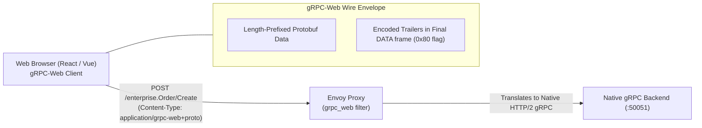

#### Production Envoy Proxy Configuration for gRPC-Web (`envoy.yaml`)
Envoy acts as the high-speed translation bridge:

```yaml
static_resources:
  listeners:
  - name: grpc_web_listener
    address:
      socket_address: { address: 0.0.0.0, port_value: 8080 }
    filter_chains:
    - filters:
      - name: envoy.filters.network.http_connection_manager
        typed_config:
          "@type": type.googleapis.com/envoy.extensions.filters.network.http_connection_manager.v3.HttpConnectionManager
          stat_prefix: grpc_web_http
          codec_type: AUTO
          route_config:
            name: local_route
            virtual_hosts:
            - name: local_service
              domains: ["*"]
              routes:
              - match: { prefix: "/" }
                route: { cluster: grpc_backend_cluster, timeout: 0s }
              cors:
                allow_origin_string_match:
                - safe_regex: { regex: ".*" }
                allow_methods: GET, PUT, DELETE, POST, OPTIONS
                allow_headers: keep-alive,user-agent,cache-control,content-type,content-transfer-encoding,x-accept-content-transfer-encoding,x-accept-response-streaming,x-user-agent,x-grpc-web,grpc-timeout
                max_age: "1728000"
                expose_headers: grpc-status,grpc-message
          http_filters:
          - name: envoy.filters.http.grpc_web # Decodes gRPC-Web into native gRPC
            typed_config:
              "@type": type.googleapis.com/envoy.extensions.filters.http.grpc_web.v3.GrpcWeb
          - name: envoy.filters.http.cors
            typed_config:
              "@type": type.googleapis.com/envoy.extensions.filters.http.cors.v3.Cors
          - name: envoy.filters.http.router
            typed_config:
              "@type": type.googleapis.com/envoy.extensions.filters.http.router.v3.Router

  clusters:
  - name: grpc_backend_cluster
    connect_timeout: 0.25s
    type: LOGICAL_DNS
    http2_protocol_options: {} # Native HTTP/2 downstream
    lb_policy: ROUND_ROBIN
    load_assignment:
      cluster_name: grpc_backend_cluster
      endpoints:
      - lb_endpoints:
        - endpoint:
            address:
              socket_address: { address: 127.0.0.1, port_value: 50051 }
```


---

## Stage 6: Enterprise Security, Reflection, Health Checking & Observability

### 6.1 Enterprise Security: Mutual TLS (mTLS) & Per-RPC Credentials

Production microservices enforce **Zero Trust**: every service must cryptographically prove its identity, and every request must carry authenticated user credentials:

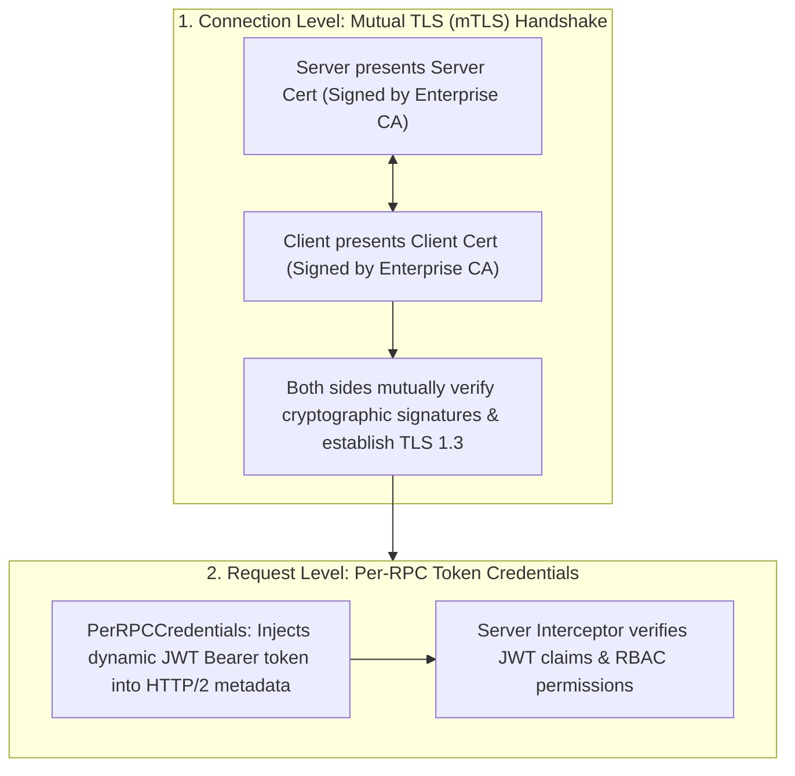

#### Production Go Server with Mutual TLS (mTLS):
```go
package main

import (
	"crypto/tls"
	"crypto/x509"
	"log"
	"os"

	"google.golang.org/grpc"
	"google.golang.org/grpc/credentials"
)

func NewSecureServer() *grpc.Server {
	// 1. Load Server Certificate and Private Key
	serverCert, err := tls.LoadX509KeyPair("certs/server.crt", "certs/server.key")
	if err != nil {
		log.Fatalf("failed to load server keypair: %v", err)
	}

	// 2. Load Root Certificate Authority (CA) to verify client certs
	caCert, err := os.ReadFile("certs/ca.crt")
	if err != nil {
		log.Fatalf("failed to read CA certificate: %v", err)
	}
	caCertPool := x509.NewCertPool()
	caCertPool.AppendCertsFromPEM(caCert)

	// 3. Configure TLS with Mutual Client Authentication
	tlsConfig := &tls.Config{
		Certificates: []tls.Certificate{serverCert},
		ClientAuth:   tls.RequireAndVerifyClientCert, // MANDATES valid client certificate
		ClientCAs:    caCertPool,
		MinVersion:   tls.VersionTLS13,
	}

	return grpc.NewServer(grpc.Creds(credentials.NewTLS(tlsConfig)))
}
```

#### Client-Side Dynamic JWT Injection (`PerRPCCredentials`):
```go
type TokenAuth struct {
	token string
}

func (t *TokenAuth) GetRequestMetadata(ctx context.Context, uri ...string) (map[string]string, error) {
	return map[string]string{
		"authorization": "Bearer " + t.token,
	}, nil
}

func (t *TokenAuth) RequireTransportSecurity() bool {
	return true // Forbids sending tokens over plaintext connections
}
```

---

### 6.2 The gRPC Server Reflection Protocol

Unlike REST APIs where endpoints can be explored via Swagger UI, gRPC servers communicate via binary Protocol Buffers. Without the original `.proto` source file, client engineers cannot inspect available methods or payload schemas.

The **gRPC Server Reflection Protocol** allows servers to expose their compiled Protobuf schema dynamically:

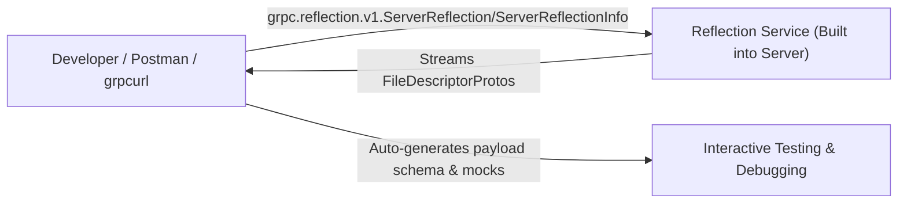

#### Enabling Server Reflection in Go:
```go
import "google.golang.org/grpc/reflection"

// Register reflection on the gRPC server instance
reflection.Register(grpcServer)
```

#### Interacting via `grpcurl` CLI:
```bash
# 1. Discover all registered services on the target server
grpcurl -plaintext localhost:50051 list
# Output:
# enterprise.orders.v1.OrderService
# grpc.health.v1.Health
# grpc.reflection.v1.ServerReflection

# 2. Inspect the complete schema of a method
grpcurl -plaintext localhost:50051 describe enterprise.orders.v1.OrderService.CreateOrder

# 3. Invoke a unary RPC directly using JSON on the command line
grpcurl -plaintext -d '{"customer_id": "CUST-99", "sku": "GPU-H100", "quantity": 8, "price_usd": 29999.0}' \
    localhost:50051 enterprise.orders.v1.OrderService/CreateOrder
```

---

### 6.3 The Standard gRPC Health Checking Protocol

Kubernetes needs a mechanism to determine whether a gRPC pod is healthy before routing production traffic to it. Using generic TCP socket probes or HTTP wrappers is an anti-pattern.

gRPC defines a standardized health checking service: **`grpc.health.v1.Health`**:

```protobuf
syntax = "proto3";

package grpc.health.v1;

message HealthCheckRequest {
  string service = 1;
}

message HealthCheckResponse {
  enum ServingStatus {
    UNKNOWN = 0;
    SERVING = 1;
    NOT_SERVING = 2;
    SERVICE_UNKNOWN = 3;
  }
  ServingStatus status = 1;
}

service Health {
  rpc Check(HealthCheckRequest) returns (HealthCheckResponse);
  rpc Watch(HealthCheckRequest) returns (stream HealthCheckResponse);
}
```

#### Registering the Health Service in Go:
```go
import "google.golang.org/grpc/health"
import healthpb "google.golang.org/grpc/health/grpc_health_v1"

healthServer := health.NewServer()
healthpb.RegisterHealthServer(grpcServer, healthServer)

// Mark service healthy
healthServer.SetServingStatus("enterprise.orders.v1.OrderService", healthpb.HealthCheckResponse_SERVING)
```

#### Native Kubernetes gRPC Probes (Kubernetes 1.24+):
Kubernetes natively supports gRPC health probes without requiring external binaries (`grpc-health-probe`):

```yaml
spec:
  containers:
  - name: order-service
    image: enterprise/order-service:v2.1
    ports:
    - containerPort: 50051
      name: grpc
    livenessProbe:
      grpc:
        port: 50051
      initialDelaySeconds: 10
      periodSeconds: 15
    readinessProbe:
      grpc:
        port: 50051
        service: enterprise.orders.v1.OrderService # Optional: checks specific service
      initialDelaySeconds: 5
      periodSeconds: 10
```

---

### 6.4 Distributed Tracing & Observability with OpenTelemetry

In a distributed call graph ($A \rightarrow B \rightarrow C$), tracking latency and failures requires distributed context propagation. OpenTelemetry instruments gRPC interceptors to inject and extract W3C TraceContext headers (`traceparent`):

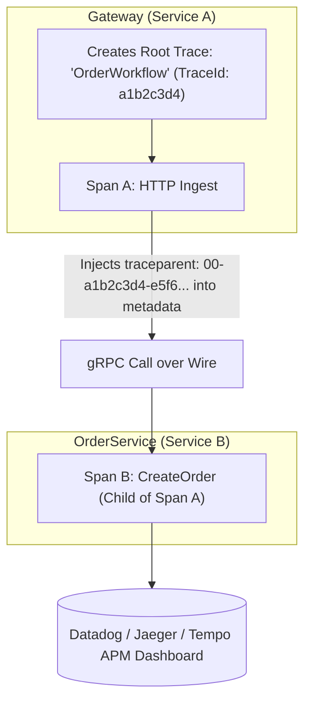

#### Key Prometheus SRE Metrics to Alert On:
1. **`grpc_server_handled_total` (Rate & Status)**: Track requests per second grouped by `grpc_code`. Alert if rate of `codes.Internal` or `codes.Unavailable` exceeds $1\%$.
2. **`grpc_server_handling_seconds` (Latency Histogram)**: Alert if P99 latency exceeds SLA (e.g. $>50\text{ms}$).
3. **`grpc_server_msg_received_total` / `sent_total`**: Monitors streaming throughput for client/server streaming RPCs.


---

## Stage 7: Production API Reference & 50 Staff-Level Interview Questions

### 7.1 Production CLI Reference & Tooling Cheatsheet

#### 1. The Protocol Buffer Compiler (`protoc`)
```bash
# Compile proto definitions into Go code and gRPC service interfaces
protoc --proto_path=. \
       --go_out=. --go_opt=paths=source_relative \
       --go-grpc_out=. --go-grpc_opt=paths=source_relative \
       enterprise/orders/v1/orders.proto

# Compile proto definitions for TypeScript / Node.js
protoc --plugin=protoc-gen-ts_proto=./node_modules/.bin/protoc-gen-ts_proto \
       --ts_proto_out=./generated \
       --ts_proto_opt=outputServices=grpc-js,env=node,esModuleInterop=true \
       enterprise/orders/v1/orders.proto

# Compile proto definitions for Python
python -m grpc_tools.protoc -I. \
       --python_out=. --grpc_python_out=. \
       enterprise/orders/v1/orders.proto
```

#### 2. `grpcurl` Production Command Cheatsheet
```bash
# Inspect all exposed gRPC services via Server Reflection
grpcurl -plaintext localhost:50051 list

# Describe a specific service or method signature
grpcurl -plaintext localhost:50051 describe enterprise.orders.v1.OrderService

# Invoke a Unary RPC with JSON payload
grpcurl -plaintext -d '{"customer_id": "CUST-100", "sku": "GPU-A100", "quantity": 4, "price_usd": 12500.0}' \
    localhost:50051 enterprise.orders.v1.OrderService/CreateOrder

# Invoke a Server-Streaming RPC (prints streamed JSON frames in real time)
grpcurl -plaintext -d '{"customer_id": "CUST-100"}' \
    localhost:50051 enterprise.orders.v1.OrderService/StreamOrderUpdates

# Query standard gRPC health check status
grpcurl -plaintext -d '{"service": "enterprise.orders.v1.OrderService"}' \
    localhost:50051 grpc.health.v1.Health/Check
```

---

### 7.2 50 Staff-Level Technical Interview Questions & In-Depth Architectural Answers

#### Category 1: HTTP/2 Transport & Binary Framing

##### Q1: What exact technical mechanisms make gRPC significantly faster than REST over HTTP/1.1?
**Answer:**
1. **Binary Protobuf vs Textual JSON**: Protobuf uses compact Tag-Length-Value binary encoding with variable-length varints. It skips field keys and string delimiters, reducing payload size by 60–80% and drastically reducing CPU serialization/deserialization time.
2. **HTTP/2 Multiplexing**: Multiple concurrent RPCs are interleaved as binary frames across a single long-lived TCP connection, eliminating the TCP handshake and TLS negotiation latency for subsequent calls.
3. **HPACK Header Compression**: Maintains a synchronized stateful compression table on client and server. Repeated HTTP headers (e.g. `user-agent`, `authorization`, `content-type`) are compressed into 1-byte indices.
4. **Length-Prefixed Framing**: gRPC frames each message with a 5-byte header (1 compression flag byte + 4 message length bytes), allowing zero-copy parsing without scanning for end-of-message delimiters.

##### Q2: Explain the relationship between a Connection, a Stream, and a Frame in HTTP/2.
**Answer:**
- **Connection**: A single physical, bidirectional TCP socket between client and server (e.g., port 50051).
- **Stream**: A logical, bidirectional byte channel within an active connection. Each gRPC RPC invocation occupies exactly one stream. Streams have unique integer IDs (client-initiated streams use odd numbers $1, 3, 5 \dots$; server-initiated use even numbers).
- **Frame**: The smallest atomic unit of communication in HTTP/2. A stream consists of multiple frames (`HEADERS`, `DATA`, `RST_STREAM`, `WINDOW_UPDATE`). Frames from different concurrent streams are interleaved across the single TCP connection and reassembled by stream ID on the receiving end.

##### Q3: How does gRPC handle flow control at both the stream level and the connection level?
**Answer:**
HTTP/2 provides **credit-based flow control** using `WINDOW_UPDATE` frames:
1. Each receiver advertises an initial window size (default: 65,535 bytes).
2. When the sender transmits a `DATA` frame, it decrements its available window by the payload length.
3. If the window drops to 0, the sender must halt transmission.
4. As the receiving application consumes bytes from its OS/application buffer, it emits a `WINDOW_UPDATE` frame granting additional byte credits to the sender.
This operates independently at the **stream level** (preventing a single runaway streaming RPC from exhausting memory) and at the **connection level** (preventing the aggregate TCP buffer from overflowing).

##### Q4: What is the purpose of the 5-byte length-prefix in gRPC message framing?
**Answer:**
In HTTP/2, a single Protobuf message can be split across multiple `DATA` frames, or multiple small Protobuf messages can be packed into a single `DATA` frame.
The 5-byte header prepended to every gRPC message provides:
- **Byte 0 (Compression Flag)**: `0` for uncompressed, `1` for compressed (e.g. gzip, snappy).
- **Bytes 1–4 (Length)**: 32-bit big-endian unsigned integer indicating the exact byte length $L$ of the serialized Protobuf payload that follows.
The gRPC framer reads the 5 bytes, allocates exactly $L$ bytes, reads the payload, and dispatches it directly to the Protobuf deserializer.

##### Q5: What is HTTP/2 Head-of-Line (HoL) blocking and does gRPC suffer from it?
**Answer:**
HTTP/2 solves **Application-Layer HoL blocking**: multiple independent RPCs share the connection, so a slow RPC no longer blocks subsequent requests.
However, because all streams multiplex over a single TCP connection, gRPC still suffers from **Transport-Layer (TCP) HoL blocking**: if a single TCP packet drops on a lossy network, the OS TCP stack pauses delivery of all subsequent packets for *all* multiplexed streams until the dropped packet is retransmitted. 
(Note: gRPC over HTTP/3 / QUIC eliminates TCP HoL blocking by running independent UDP streams).

---

#### Category 2: Protocol Buffers (proto3) Internals & Serialization

##### Q6: How does Varint encoding serialize small integers in a single byte?
**Answer:**
Varint uses 7 bits per byte to store the binary integer and the Most Significant Bit (MSB, 8th bit) as a **continuation flag**:
- If MSB = `1`, more bytes follow.
- If MSB = `0`, this is the final byte of the integer.
For example, the integer `42` (binary `0101010`):
- Fits in 7 bits: `0101010`.
- MSB is set to `0`: `00101010` (`0x2A`). It encodes in exactly 1 byte.
Numbers up to 127 encode in 1 byte, up to 16,383 in 2 bytes, etc.

##### Q7: What is ZigZag encoding and why is it necessary for negative numbers (`sint32`/`sint64`)?
**Answer:**
In two's complement, negative numbers (e.g. `-1`) have their highest bit set. In a standard 64-bit varint, `-1` requires sign extension across all 64 bits, taking **10 bytes** of storage.
**ZigZag encoding** maps signed numbers to unsigned integers by interleaving positive and negative values:
$$0 \rightarrow 0,\ -1 \rightarrow 1,\ 1 \rightarrow 2,\ -2 \rightarrow 3,\ 2 \rightarrow 4$$
Mathematical formula:
$$\text{ZigZag}(n) = (n \ll 1) \oplus (n \gg 31)$$
This maps small negative numbers to small positive integers, allowing `-1` to be stored in **a single byte** (`0x01`).

##### Q8: What is the Tag-Length-Value (TLV) structure of Protobuf on the wire?
**Answer:**
Every field on the wire begins with a **Key Tag** encoded as a varint:
$$\text{Key Tag} = (\text{Field Number} \ll 3) \mid \text{Wire Type}$$
- The 3 least significant bits store the **Wire Type** ($0=\text{Varint}, 1=64\text{-bit}, 2=\text{Length-delimited}, 5=32\text{-bit}$).
- The remaining bits store the **Field Number**.
For wire types 0, 1, and 5, the value immediately follows the tag. For wire type 2 (strings, embedded sub-messages), a varint specifying the payload byte length follows the tag, followed by the raw bytes.

##### Q9: Why are field tag numbers 1 through 15 more efficient than tag numbers 16 and above?
**Answer:**
Because the key tag is encoded as a varint where the lower 3 bits are the wire type:
- If the field number is $\le 15$, $(\text{field\_num} \ll 3)$ fits within 7 bits ($15 \ll 3 = 120 < 128$). Therefore, the entire key tag consumes **only 1 byte** on the wire.
- For field numbers $\ge 16$, the value exceeds 127, requiring **2 or more bytes** for the tag alone.
**Best Practice**: Reserve field tags 1 through 15 for the most frequently transmitted fields in your data model.

##### Q10: Why are default values in proto3 not serialized over the wire?
**Answer:**
In proto3, if a field holds its default value (`0`, `""`, `false`, empty list), the serializer omits the field entirely from the payload.
- **Advantage**: Saves bandwidth; sparse messages with dozens of unset fields serialize to zero bytes.
- **Consequence**: The receiver cannot distinguish between a field explicitly set to `0` and a field that was unset/omitted. To differentiate, developers must wrap fields in `google.protobuf.Int32Value` wrappers or use the `optional` keyword introduced in modern proto3.

---

#### Category 3: The Four Streaming RPC Patterns

##### Q11: In a Bidirectional Streaming RPC, how do the client and server coordinate stream termination?
**Answer:**
In Bidi streaming, the client and server send independent streams over the same HTTP/2 stream ID:
1. The client sends messages via `stream.Send()`.
2. When finished sending, the client calls `stream.CloseSend()`, which emits an HTTP/2 `DATA` frame with the `END_STREAM` flag set (`0x01`).
3. The server's `stream.Recv()` returns `io.EOF`, signaling that client input has ended.
4. The server can continue sending messages to the client as long as necessary.
5. When the server finishes, it returns `nil` (or error) from the handler, which sends HTTP/2 `HEADERS` with `grpc-status` and `END_STREAM`, cleanly closing the stream in both directions.

##### Q12: What happens if a client in a Server-Streaming RPC reads slower than the server produces?
**Answer:**
HTTP/2 flow control kicks in:
1. The client's TCP socket buffer and HTTP/2 stream receive window fill up.
2. The client stops emitting `WINDOW_UPDATE` frames.
3. The server's outbound HTTP/2 buffer reaches its limit.
4. On the server, `stream.Send()` blocks synchronously.
5. If the server does not handle blocking gracefully, server memory can grow or worker goroutines become backpressured until the client catches up or the context deadline expires.

##### Q13: When should you choose Server-Streaming RPC over WebSocket?
**Answer:**
- **Choose Server-Streaming gRPC**: For internal backend-to-backend services, microservices event feeds, and mobile apps. Provides strong Protobuf typing, automatic code generation, HTTP/2 multiplexing over existing channels, and native deadline/cancellation propagation.
- **Choose WebSocket**: For public browser clients that require legacy HTTP/1.1 compatibility, or where arbitrary non-HTTP/2 proxies sit in the network path.

##### Q14: How does Client-Streaming handle server errors that occur before the client finishes uploading?
**Answer:**
If the server encounters a validation failure or internal error while the client is still streaming chunks:
1. The server can immediately return an error status code (e.g. `codes.InvalidArgument`).
2. The gRPC server transport sends an HTTP/2 `RST_STREAM` frame to the client.
3. On the client, the next call to `stream.Send()` fails immediately with an error, allowing the client to halt uploading a large file rather than wasting bandwidth.

---

#### Category 4: Interceptors, Deadlines & Context Propagation

##### Q15: How does Deadline propagation prevent cascading microservice failures?
**Answer:**
When Service A calls Service B with a 2-second timeout:
1. Service A converts the timeout into an absolute UTC timestamp ($T_{\text{now}} + 2000\text{ms}$).
2. Service A calculates remaining time and sends it in the `grpc-timeout` header (e.g. `2000m`).
3. Service B receives the header, creates a child context with that remaining deadline, and makes a downstream call to Service C with the remaining fraction (e.g. `1400m`).
4. If Service C hangs, the deadline expires across the entire chain at the exact same instant ($T_{\text{now}} + 2000\text{ms}$). All intermediate services abort processing simultaneously via `ctx.Done()`, preventing thread starvation and cascading resource exhaustion.

##### Q16: What is the execution order when multiple Unary Server Interceptors are chained?
**Answer:**
Chained interceptors execute in an **onion/nested pipeline order**:
```go
grpc.ChainUnaryInterceptor(Int1, Int2, Int3)
```
1. Inbound Request: `Int1 (pre) -> Int2 (pre) -> Int3 (pre) -> Service Handler`
2. Outbound Response: `Service Handler -> Int3 (post) -> Int2 (post) -> Int1 (post) -> Client`
Panics caught in `Int1` can recover failures that occurred in `Int2`, `Int3`, or the handler.

##### Q17: What is the difference between gRPC Metadata and Protobuf message fields?
**Answer:**
- **Protobuf Fields**: The typed domain data payload (e.g. `order_id`, `amount_usd`) serialized inside the HTTP/2 `DATA` frame.
- **Metadata**: Out-of-band operational context (e.g. authentication Bearer tokens, distributed tracing trace IDs, client version, routing tags) transmitted inside the HTTP/2 `HEADERS` and `TRAILERS` frames. Separating metadata from payloads allows infrastructure interceptors to inspect routing/auth without deserializing the business payload.

##### Q18: What happens on the wire when a client cancels an RPC via `context.WithCancel`?
**Answer:**
1. The client application calls `cancel()`.
2. The client gRPC transport immediately sends an HTTP/2 **`RST_STREAM` frame** with error code `CANCEL` (`0x08`) over the active stream ID.
3. The server's HTTP/2 framer reads the `RST_STREAM` frame and closes the server-side context channel (`ctx.Done()`).
4. The server handler unblocks from `<-ctx.Done()`, aborts in-flight work (e.g. rolling back a database transaction), and terminates the goroutine.

---

#### Category 5: High-Performance Load Balancing & Name Resolution

##### Q19: Why does a standard Kubernetes ClusterIP Service cause all gRPC traffic to route to a single pod?
**Answer:**
Kubernetes `ClusterIP` uses **Layer 4 (L4) load balancing** implemented via Linux IPTables/IPVS. L4 operates at the TCP layer: when a client dials the service IP, IPTables picks one pod and routes the TCP handshake to it.
Because gRPC uses HTTP/2, **all subsequent RPCs are multiplexed over that single long-lived TCP connection**. Even if 100 new pods spin up, the TCP connection remains pinned to the original pod, causing a single pod to handle 100% of the load while other pods idle.

##### Q20: How does Client-Side Load Balancing with a Headless Service solve this?
**Answer:**
1. In a **Headless Service** (`clusterIP: None`), Kubernetes DNS does not return a single virtual IP; it returns an **A record containing the individual IP addresses of all healthy pods**.
2. The gRPC client's internal name resolver (`dns:///`) resolves these IPs.
3. The client's channel manager opens and maintains distinct TCP connections (**subchannels**) to *every* pod IP.
4. When an RPC is invoked, the client-side load balancing policy (`round_robin`) distributes individual RPCs across the open subchannels in memory, achieving perfect load distribution with zero intermediate proxy latency.

##### Q21: What are the trade-offs of Client-Side Load Balancing vs Envoy Proxy-Based Load Balancing?
**Answer:**
- **Client-Side Balancing**:
  - *Pros*: Zero network hop latency; direct pod-to-pod communication; no proxy infrastructure to deploy or manage.
  - *Cons*: Client binary must include gRPC resolver/balancer logic; complex to configure in polyglot teams; subchannel connection counts multiply quadratically ($M\text{ clients} \times N\text{ servers}$).
- **Proxy-Based (Envoy)**:
  - *Pros*: Decoupled architecture; polyglot clients need no special libraries; centralized TLS termination, rate limiting, and observability.
  - *Cons*: Extra network hop adds 0.5–1.5ms latency; Envoy pods require CPU/memory provisioning and autoscaling.

##### Q22: What is the xDS Protocol in gRPC service mesh architectures?
**Answer:**
xDS (eXtended Discovery Service) is the control plane protocol pioneered by Envoy. In modern gRPC (**Proxyless gRPC**), the gRPC client library speaks directly to the control plane (e.g. Istio) via xDS:
- **LDS (Listener Discovery)**: Discovers virtual ports and routes.
- **RDS (Route Discovery)**: Discovers dynamic path matching and canary weighting.
- **CDS (Cluster Discovery)**: Discovers upstream backend clusters.
- **EDS (Endpoint Discovery)**: Discovers live pod IPs and health states.
The client gains advanced service mesh capabilities (traffic splitting, canary deployments, mTLS) without the latency overhead of running sidecar proxy containers.

---

#### Category 6: Error Handling & Resilience

##### Q23: Why should applications never return generic `codes.Internal` or `codes.Unknown` for validation errors?
**Answer:**
Returning generic error codes prevents automated client resilience:
- Automated retry interceptors rely on specific status codes (e.g. `codes.Unavailable`) to safely retry requests.
- If a server returns `codes.Internal` for a client-side invalid parameter, the client cannot programmatically distinguish between a buggy database connection (which might recover on retry) and an invalid email string (which will never succeed).
- Always use `codes.InvalidArgument` for client input bugs, and `codes.FailedPrecondition` for invalid state.

##### Q24: What is the difference between Retrying and Hedging in gRPC client resilience?
**Answer:**
- **Retrying**: Sequential. Attempt 1 fails $\rightarrow$ wait backoff delay $\rightarrow$ issue Attempt 2. Minimizes extra cluster load, but increases overall request latency.
- **Hedging**: Parallel. Attempt 1 is issued $\rightarrow$ if no reply after `hedgingDelay` (e.g. 25ms), issue Attempt 2 concurrently to a *different* pod without waiting for Attempt 1 to fail. Slashes P99 tail latency, at the cost of generating duplicate compute load during cluster slowdowns.

##### Q25: How does the `grpc-status-details-bin` trailing header transmit the Rich Error Model?
**Answer:**
Standard gRPC status codes and error messages travel in plaintext HTTP/2 trailers: `grpc-status: 3` and `grpc-message: Invalid argument`.
For rich errors, the server serializes a `google.rpc.Status` Protobuf message (which contains an array of `google.protobuf.Any` objects holding `BadRequest`, `RetryInfo`, etc.) into raw binary, **Base64-encodes** the binary bytes, and places them into the **`grpc-status-details-bin`** trailer header. The client interceptor decodes and unmarshals this trailer.

---

#### Category 7: Security, Authentication & Observability

##### Q26: What is Mutual TLS (mTLS) and how does it prevent Man-in-the-Middle (MITM) attacks?
**Answer:**
In standard TLS, only the server presents a certificate to prove its identity to the client.
In **Mutual TLS (mTLS)**:
1. The server presents a certificate; the client verifies it against an internal CA truststore.
2. The client *also* presents its own x509 certificate to the server during the TLS handshake.
3. The server cryptographically validates that the client's certificate was signed by the enterprise Certificate Authority and extracts the client's identity from the Subject Alternative Name (SAN, e.g. `spiffe://cluster.local/ns/prod/sa/payment-service`).
Unauthenticated attackers without a valid CA-signed private key cannot establish a TCP handshake.

##### Q27: What is the difference between Channel Credentials and Call Credentials in gRPC?
**Answer:**
- **Channel Credentials (Transport Level)**: Governs the physical TCP connection (e.g. `credentials.NewTLS(...)`). Encrypts all traffic on the wire and performs mutual TLS identity verification. Established once per connection.
- **Call Credentials (Per-RPC Level)**: Governs individual RPC requests (e.g. `oauth2.TokenSource` or `PerRPCCredentials`). Injects dynamic user tokens (JWT, OAuth2 Bearer tokens) into the metadata headers of specific RPCs, verified on every invocation.

##### Q28: How does the standard gRPC Health Checking Protocol prevent cascading deployment failures?
**Answer:**
The `grpc.health.v1.Health` service exposes two methods:
- **`Check`**: Unary RPC returning `SERVING` or `NOT_SERVING`.
- **`Watch`**: Server-streaming RPC that pushes immediate status updates when internal dependencies fail.
During rolling updates, Kubernetes readiness probes query `Check`. If a pod's database connection pool fails, the service transitions to `NOT_SERVING`, causing Kubernetes to immediately stop routing ingress traffic to that pod before users experience 500 errors.

---

#### Category 8: Advanced Production Tuning & Edge Cases

##### Q29: What is the default gRPC maximum message receive size and how do you handle larger payloads?
**Answer:**
The default maximum message receive size is **4 MB** (`4194304` bytes). Attempting to receive a message exceeding 4 MB results in `codes.ResourceExhausted: Received message larger than max (X vs 4194304)`.
To configure larger limits:
```go
grpc.NewServer(grpc.MaxRecvMsgSize(20 * 1024 * 1024)) // 20 MB
```
**Architectural Guidance**: Sending 50 MB Protobuf blobs is an anti-pattern because it consumes excessive memory during unmarshaling. Use **Client-Streaming** to chunk large files into 64 KB fragments, or use the **Claim-Check Pattern** (upload to S3/GCS and pass the URI).

##### Q30: Why should you never use `grpc.Dial` in modern Go applications?
**Answer:**
`grpc.Dial` and `grpc.DialContext` have been deprecated in modern `google.golang.org/grpc` (v1.60+) because they suffered from complex, blocking connection semantics and inconsistent resolver behaviors.
Developers should use **`grpc.NewClient`**, which creates a client handle with non-blocking lazy connection semantics, full support for modern name resolvers (`dns:///`), and explicit service config integration.

##### Q31: How do you prevent connection churn when clients send bursty, infrequent RPCs?
**Answer:**
By configuring **Client Keepalive Parameters**:
```go
var keepaliveParams = keepalive.ClientParameters{
    Time:                30 * time.Second, // Send PING if no activity for 30s
    Timeout:             10 * time.Second, // Wait 10s for PING ACK before closing
    PermitWithoutStream: true,             // Allow PINGs even when no active RPCs exist
}
```
This sends lightweight HTTP/2 `PING` frames to keep intermediate firewalls and NAT gateways from silently terminating idle TCP sockets, preventing expensive TLS renegotiations on the next user request.

##### Q32: What is the purpose of the `grpc-web` translation filter in Envoy?
**Answer:**
The `envoy.filters.http.grpc_web` filter bridges browser clients to native gRPC:
1. It inspects incoming HTTP/1.1 or HTTP/2 `POST` requests with `Content-Type: application/grpc-web`.
2. It strips the gRPC-Web envelope and transforms it into native gRPC wire format.
3. Downstream, when the backend server returns HTTP/2 trailing headers (`grpc-status`), Envoy serializes the trailers into a special final data frame with bit-flag `0x80` and streams it back to the browser JavaScript client.

##### Q33: How do you gracefully shut down a gRPC server without dropping in-flight streaming requests?
**Answer:**
Invoke **`grpcServer.GracefulStop()`**:
1. The server stops accepting new connections on its listener.
2. The server sends HTTP/2 `GOAWAY` frames to all active connections, informing clients not to send new RPCs.
3. The server waits for all active unary RPCs and streaming RPCs to complete naturally.
4. If requests exceed a graceful deadline (e.g. 30 seconds), the application invokes `grpcServer.Stop()` to forcefully terminate remaining connections.

##### Q34: What is the performance cost of Protobuf `Any` fields and when should they be avoided?
**Answer:**
A `google.protobuf.Any` message stores an arbitrary serialized binary message along with a type URL string (`type.googleapis.com/packagename.MessageName`).
- *Cost*: It requires **two deserialization passes** (first deserializing the outer message, then parsing the `Any` bytes into the concrete struct using reflection).
- *Guidance*: Avoid `Any` in high-throughput hot paths. Use Protobuf **`oneof`** structures instead, which provide type safety and single-pass binary decoding.

##### Q35: How does connection pooling operate in gRPC, and when should multiple channels be opened?
**Answer:**
In gRPC, a single `ClientConn` multiplexes hundreds or thousands of concurrent RPCs over a single TCP connection. However:
- A single TCP socket is limited by a single OS kernel send/receive buffer and can saturate a single CPU core handling network interrupts.
- HTTP/2 servers enforce `MAX_CONCURRENT_STREAMS` (typically 100 to 250). If concurrency exceeds this limit, new RPCs block waiting for streams to open.
**When to Pool Channels**: If an application requires more than 50,000 requests per second or pushes $>500\text{ MB/s}$ of throughput, establish a client-side channel pool (e.g. 4 to 8 distinct `ClientConn` instances) and round-robin RPCs across them.

##### Q36: What is the purpose of `MAX_CONNECTION_AGE` and `MAX_CONNECTION_AGE_GRACE`?
**Answer:**
Because gRPC connections are long-lived, new pods added during horizontal autoscaling may receive zero traffic if existing clients never disconnect.
- **`MAX_CONNECTION_AGE` (e.g. 15m to 1h)**: The maximum time a server allows a connection to remain open before sending an HTTP/2 `GOAWAY` frame.
- **`MAX_CONNECTION_AGE_GRACE` (e.g. 30s)**: Grace period allowing active in-flight RPCs to complete before forcefully terminating the TCP connection.
When `GOAWAY` is received, the client opens a fresh connection, which re-resolves DNS and distributes load evenly across newly scaled pods.

##### Q37: How does gRPC communicate over UNIX Domain Sockets (UDS) for IPC?
**Answer:**
For microservices running on the same host or containers sharing a pod volume in Kubernetes:
```go
// Server listening on UDS
lis, err := net.Listen("unix", "/tmp/grpc-engine.sock")

// Client connecting to UDS
conn, err := grpc.NewClient("unix:///tmp/grpc-engine.sock", grpc.WithTransportCredentials(insecure.NewCredentials()))
```
UDS completely bypasses the TCP/IP stack, network interfaces, and checksum calculations, dropping latency by up to **$50\%$** and delivering millions of RPCs/sec between local sidecars.

##### Q38: How do you design backward-compatible Enums in proto3?
**Answer:**
1. **Always reserve the 0 tag for an `UNSPECIFIED` value**: `UNKNOWN_STATUS = 0`. In proto3, if no value is set, it defaults to tag 0. If tag 0 is a business state (e.g. `PENDING = 0`), clients cannot tell if the value was explicitly set to pending or merely default-initialized.
2. **Never change existing enum integer values**.
3. In modern Protobuf, unknown enum values sent by newer servers are preserved in the unrecognized field set rather than crashing older client deserializers.

##### Q39: What is the `grpc-gateway` and how does it provide dual REST/JSON and gRPC endpoints?
**Answer:**
`grpc-gateway` is a compiler plugin for `protoc` that reads custom Google HTTP API annotations in `.proto` files:
```protobuf
rpc GetOrder(OrderRequest) returns (OrderResponse) {
  option (google.api.http) = {
    get: "/v1/orders/{order_id}"
  };
}
```
It generates a reverse-proxy server that translates incoming RESTful JSON HTTP/1.1 requests into native binary gRPC requests, allowing organizations to maintain a single gRPC backend that simultaneously serves legacy REST clients and public web browsers.

##### Q40: What are Protobuf Field Masks (`google.protobuf.FieldMask`) and how do they implement partial updates?
**Answer:**
In REST APIs, partial updates are implemented via HTTP `PATCH`. In gRPC, Protobuf default values make it impossible to tell if a field was omitted or intentionally set to an empty string.
**FieldMask** solves this:
```protobuf
message UpdateOrderRequest {
  Order order = 1;
  google.protobuf.FieldMask update_mask = 2; // e.g. paths: ["status", "shipping_address"]
}
```
The server inspects `update_mask.Paths` and updates *only* the specific fields explicitly listed by the client, leaving all other database columns unchanged.

##### Q41: How do you unit-test gRPC services in CI/CD without binding to real TCP network ports?
**Answer:**
Use the **in-memory listener** (`google.golang.org/grpc/test/bufconn` in Go):
```go
const bufSize = 1024 * 1024
lis := bufconn.Listen(bufSize)
grpcServer := grpc.NewServer()
pb.RegisterOrderServiceServer(grpcServer, &server{})
go grpcServer.Serve(lis)

// Dial the in-memory buffer
conn, err := grpc.NewClient("passthrough://bufnet",
    grpc.WithContextDialer(func(context.Context, string) (net.Conn, error) {
        return lis.Dial()
    }),
    grpc.WithTransportCredentials(insecure.NewCredentials()),
)
```
Tests execute with microsecond latency without port collision risks in parallel CI test pipelines.

##### Q42: What causes `GOAWAY: HTTP/2 ping flood` errors and how do you configure keepalive enforcement?
**Answer:**
If aggressive clients send frequent HTTP/2 `PING` frames (e.g. every 1 second), it can overwhelm server CPU.
The server protects itself with **Keepalive Enforcement Policies**:
```go
var kaep = keepalive.EnforcementPolicy{
    MinTime:             5 * time.Second, // Minimum wait time between client pings
    PermitWithoutStream: false,           // Forbid pings when no active streams exist
}
```
If a rogue client sends pings faster than `MinTime`, the server emits an HTTP/2 `GOAWAY` frame with error code `ENHANCE_YOUR_CALM` and forcefully terminates the TCP connection.

##### Q43: How does Protobuf `oneof` manage memory and enforce exclusivity?
**Answer:**
A `oneof` block ensures that **at most one field** in the set can be populated at any given time:
```protobuf
message PaymentMethod {
  oneof method {
    CreditCard credit_card = 1;
    BankTransfer bank_transfer = 2;
    CryptoWallet crypto_wallet = 3;
  }
}
```
- In memory: Generated structs use a union or interface pointer, allocating memory only for the active variant.
- Setting any one field automatically clears all other fields in the `oneof`.
- On the wire: Only the single active field tag and its payload are serialized.

##### Q44: What is the difference between `grpc.MaxRecvMsgSize` and `grpc.MaxSendMsgSize`?
**Answer:**
- `MaxRecvMsgSize` (default: 4 MB): The maximum message payload length the server or client is willing to read from the wire. Exceeding it returns `ResourceExhausted`.
- `MaxSendMsgSize` (default: unlimited / math.MaxInt32): The maximum message payload length the application will serialize and transmit. Both can be adjusted independently to protect against memory exhaustion.

##### Q45: How do you implement a token bucket rate limiter in a gRPC server interceptor?
**Answer:**
Wrap the `UnaryServerInterceptor`:
1. Extract the client identifier from metadata (`authorization` header or client IP).
2. Query a token bucket rate limiter (e.g. Redis or in-memory `golang.org/x/time/rate.Limiter`).
3. If tokens are available, deduct one and invoke `handler(ctx, req)`.
4. If the bucket is empty, immediately return `status.Errorf(codes.ResourceExhausted, "rate limit exceeded: try again in 5 seconds")`.

##### Q46: How do you trace a gRPC call across multiple microservices with OpenTelemetry?
**Answer:**
OpenTelemetry gRPC interceptors automatically extract and inject the W3C TraceContext:
1. In Client Interceptor: Injects `traceparent` (Trace ID, Span ID, Trace Flags) into outgoing metadata headers.
2. Across Wire: Headers travel inside the HTTP/2 `HEADERS` frame.
3. In Server Interceptor: Reads `traceparent` from incoming metadata and attaches it as the parent span of the server's local OpenTelemetry context.
The entire cross-service call tree is unified into a single visual distributed trace in Jaeger, Tempo, or Datadog.

##### Q47: What is the purpose of the `authority` header in gRPC and how does it relate to TLS SNI?
**Answer:**
In HTTP/2, the `:authority` pseudo-header replaces the HTTP/1.1 `Host` header. It specifies the target virtual host. During TLS handshakes, this value is passed as the Server Name Indication (SNI), allowing reverse proxies like Envoy to present the correct TLS certificate and route traffic to the intended backend service.

##### Q48: How do you handle serialization of timestamps in Protobuf?
**Answer:**
Never use raw integer milliseconds or string ISO-8601 timestamps. Use Google's standardized well-known type: **`google.protobuf.Timestamp`**:
```protobuf
import "google/protobuf/timestamp.proto";

message AuditLog {
  google.protobuf.Timestamp event_time = 1;
}
```
It encodes time as UTC seconds since the Unix epoch (int64) plus sub-second nanoseconds (int32), avoiding timezone ambiguity and floating-point rounding errors across different programming languages.

##### Q49: What is the difference between client-side interceptors `Invoker` and `Streamer`?
**Answer:**
- **`grpc.UnaryInvoker`**: Function signature `func(ctx, method, req, reply, cc, ...)` that performs the actual network round-trip for a unary RPC. The unary client interceptor wraps this invoker.
- **`grpc.Streamer`**: Function signature `func(ctx, desc, cc, method, ...)` that initializes a new `ClientStream`. The streaming client interceptor wraps the streamer to return a customized stream wrapper.

##### Q50: What is the single most critical architectural principle for engineering fault-tolerant gRPC systems at scale?
**Answer:**
**Enforce Immutable Schema Evolution, End-to-End Deadlines, and L7 Transport Load Balancing**.
1. **Schema**: Never mutate existing Protobuf field tags; treat `.proto` definitions as inviolable binary contracts.
2. **Resilience**: Every RPC must carry an absolute deadline propagated via context; retries must be restricted strictly to idempotent methods with exponential backoff and jitter.
3. **Transport**: Deploy L7 client-side load balancing (via Kubernetes headless services) or Envoy proxies to prevent HTTP/2 long-lived multiplexed connections from pinning traffic to single pods.


---

## Summary & Next Steps

Congratulations on completing the **gRPC & Protocol Buffers Staff-Level Masterclass**! You have mastered:
- The binary wire mechanics of Protocol Buffers (proto3), Varints, ZigZag encoding, and HTTP/2 binary framing.
- Designing and implementing all four RPC paradigms (Unary, Server-Streaming, Client-Streaming, Bi-Directional Streaming) with production Go and TypeScript SDKs.
- Constructing chained interceptor middleware pipelines for auth, observability, distributed tracing, and panic recovery.
- End-to-end deadline propagation to eliminate zombie compute, cancellation via `RST_STREAM`, and rich error handling with `google.rpc.Status`.
- Solving the HTTP/2 L4 load balancing problem using Kubernetes Headless Services, client-side round-robin subchannels, and Envoy gRPC-Web bridges.
- Zero-trust enterprise security with Mutual TLS (mTLS), Server Reflection with `grpcurl`, and standard Kubernetes gRPC health probes.
- 50 staff-level technical interview challenges covering the full frontier of high-performance microservices engineering.

Continue expanding your capabilities in the `the-learninghub` ecosystem to master OAuth, Kafka, Vector Databases, and Enterprise System Design!
